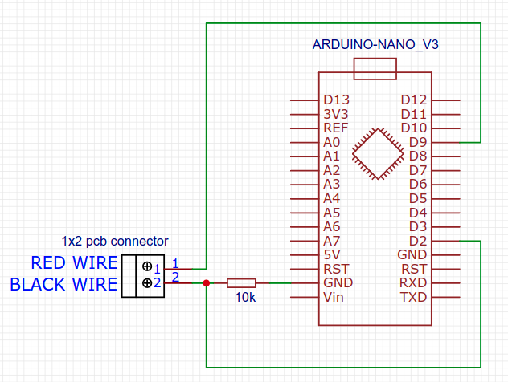
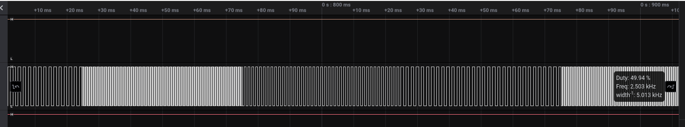

# iot-wire-tracker-tx

<!-- TOC -->
* [Description](#description)
  + [Usage](#usage)
* [Notes](#notes)
* [How this project was built](#how-this-project-was-built)
<!-- TOCEND -->

## Description

Crude replacement for a damaged wire tracker tx module.

Generates a square signal train ( 50% duty ) on pin 9 suitable for a wire tracker transmitter with follow train sequence:
- 50ms @2500 hz
- 50ms @833 hz
- 50ms @625 hz

### Usage

example:
| **tx side** | **other side** |
|---|---|
| cable_txred | cable_unk1 |
| cable_black | cable_unk2 |
|  | ... |
|  | cable_unkX |

:warning: **Warnings** :
- ensure no voltage present on cables either for the tx side and other side cables

- connect cable_txred to the pin 9
- connect cable_black to the 10k resistor that in turn connects to GND 
- go to the other side with the wire tracker rx tool ( not provided ) that amplify into a speaker detected signal moving the point on wires
- two wires ( corresponding to the counterpart cable_txred and cable_black ) cause high volume on speaker
- counterverify if cable_unk1 e and cable_unk2 are those searched by connecting them together and if the speaker stop this mean that they are those matching source tx.
- place a mark on two wires matched
- **important** : go to the tx side and disconnect cable_txred, cable_black before to reapply any voltage on cables or tx module could get damaged

## Notes
- 10k resistor allow to safely short circuit between red, black wire to cancel the signal in the counterverify step without destroy the pin9 port because of high level output while connects to gnd ( black cable )

## How this project was built

- from platformio / projects / new selecting arduino nano (new bootloader)
- from platformio / libraries / added TimerInterrupt
